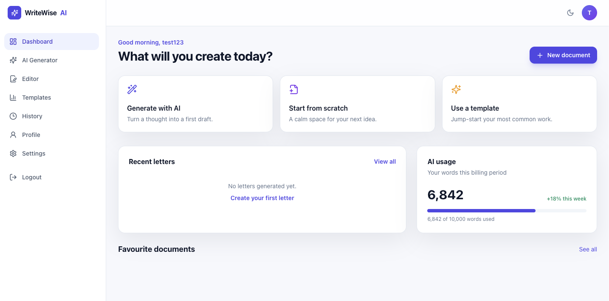
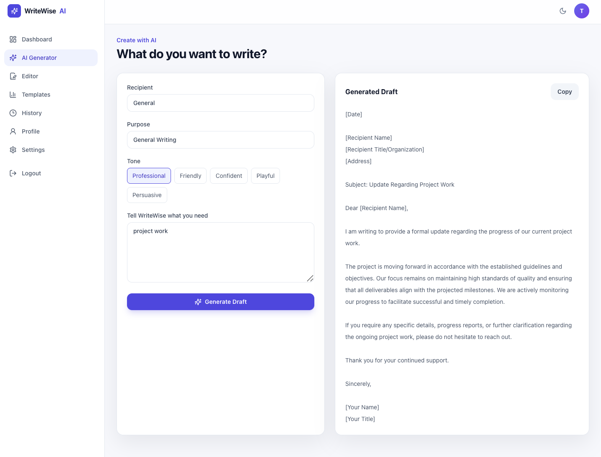
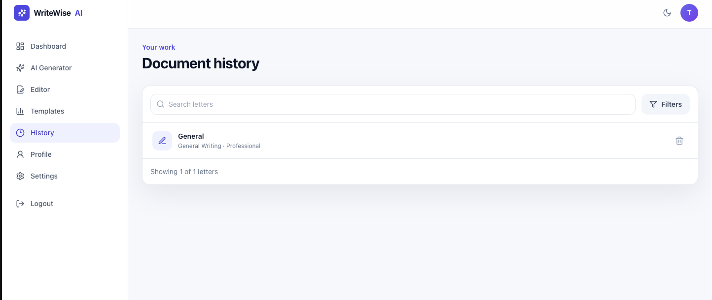

# WriteWise AI

> AI-powered professional writing assistant for generating clear, context-aware letters and messages.

WriteWise AI is a full-stack AI writing platform that helps users create professional letters and messages from a small set of inputs such as recipient, purpose, tone, and writing requirements.

The application combines a React frontend, FastAPI backend, PostgreSQL database, JWT authentication, and Google's Gemini API into an end-to-end deployed application.

---

##  Live Application

**Frontend:**  
https://writewise-ai-frontend.onrender.com

**Backend API:**  
https://writewise-ai-1.onrender.com

**API Documentation:**  
https://writewise-ai-1.onrender.com/docs


---

##  Features

###  AI-Powered Letter Generation

Generate professional writing using:

- Recipient
- Purpose
- Tone
- User-provided requirements

Supported tones include:

- Professional
- Friendly
- Confident
- Playful
- Persuasive

WriteWise sends the structured request to the backend, builds an AI prompt, generates the response using Gemini, cleans the response, and returns the generated letter to the frontend.

###  Authentication

WriteWise includes user authentication using:

- User registration
- User login
- Password hashing with bcrypt
- JWT access tokens
- Protected API endpoints

Passwords are never stored as plain text.

###  Letter History

Generated letters are stored in PostgreSQL and associated with the authenticated user.

Users can:

- View previously generated letters
- Open individual letters
- Copy generated content
- Delete letters

###  Templates

Users can start from predefined writing templates and automatically populate the generator with an appropriate purpose and starting prompt.

###  REST API

The backend is built with FastAPI and provides versioned endpoints for:

- Authentication
- User information
- Letter generation
- Letter history
- Individual letter retrieval
- Letter deletion
- Health/status information

###  Persistent Database

Production data is stored in PostgreSQL.

Database schema changes are managed using Alembic migrations.

---

##  Architecture

```text
                         ┌──────────────────────┐
                         │     React Frontend   │
                         │                      │
                         │  Authentication      │
                         │  Letter Generator    │
                         │  Templates           │
                         │  History             │
                         │  Profile             │
                         └──────────┬───────────┘
                                    │
                                    │ REST API
                                    ▼
                         ┌──────────────────────┐
                         │     FastAPI API      │
                         │                      │
                         │  Authentication      │
                         │  Letter Endpoints    │
                         │  User Endpoints      │
                         │  Validation          │
                         │  Middleware          │
                         └───────┬───────┬──────┘
                                 │       │
                    ┌────────────┘       └─────────────┐
                    ▼                                  ▼
          ┌──────────────────┐               ┌──────────────────┐
          │   PostgreSQL     │               │   Gemini API     │
          │                  │               │                  │
          │ Users            │               │ AI Generation    │
          │ Letters          │               │                  │
          └──────────────────┘               └──────────────────┘

```

----
## Application Flow

```text
        User
         │
         ▼
    Login / Register
         │
         ▼
    Letter Generator
         │
         ├── Recipient
         ├── Purpose
         ├── Tone
         └── Requirements
         │
         ▼
    FastAPI Backend
         │
         ▼
Authentication & Validation
         │
         ▼
    Prompt Builder
         │
         ▼
    Gemini API
         │
         ▼
    Response Parser
         │
         ▼
    Generated Letter
         │
         ├───────────────┐
         ▼               ▼
        Frontend       PostgreSQL
         │               │
         ▼               ▼
        View / Copy     History
        / Delete

```
----
## Tech Stack

### Frontend
    React
    TypeScript
    Vite
    Tailwind CSS
    React Router
    TanStack Query
    Axios
    Lucide React

### Backend
    Python
    FastAPI
    Uvicorn
    Pydantic
    SQLAlchemy
    Alembic

### Authentication & Security
    JWT
    python-jose
    Passlib
    bcrypt
    HTTP Bearer authentication

### AI
    Google Gemini API
    Google GenAI SDK
    Custom prompt builder
    Response parser

### Database
    PostgreSQL
    SQLite for local development
    SQLAlchemy ORM
    Alembic migrations

### Deployment
    Render
    Render PostgreSQL
    GitHub

----

## Project Structure
```text
Writewise-AI/
│
├── backend/
│   │
│   ├── app/
│   │   │
│   │   ├── api/
│   │   │   ├── api.py
│   │   │   └── v1/
│   │   │       ├── endpoints/
│   │   │       │   ├── auth.py
│   │   │       │   ├── health.py
│   │   │       │   ├── info.py
│   │   │       │   ├── letters.py
│   │   │       │   └── root.py
│   │   │       └── router.py
│   │   │
│   │   ├── ai/
│   │   │   ├── llm_client.py
│   │   │   ├── parser.py
│   │   │   └── prompt_builder.py
│   │   │
│   │   ├── auth/
│   │   │   ├── dependencies.py
│   │   │   ├── hashing.py
│   │   │   └── jwt_handler.py
│   │   │
│   │   ├── core/
│   │   │   ├── config.py
│   │   │   ├── exceptions.py
│   │   │   ├── logging.py
│   │   │   └── middleware.py
│   │   │
│   │   ├── db/
│   │   │   ├── base.py
│   │   │   └── database.py
│   │   │
│   │   ├── models/
│   │   │   ├── user.py
│   │   │   └── letter.py
│   │   │
│   │   ├── repositories/
│   │   │   ├── user_repository.py
│   │   │   └── letter_repository.py
│   │   │
│   │   ├── schemas/
│   │   │   ├── auth.py
│   │   │   └── letter.py
│   │   │
│   │   ├── services/
│   │   │   ├── ai_service.py
│   │   │   └── auth_service.py
│   │   │
│   │   └── main.py
│   │
│   ├── alembic/
│   ├── tests/
│   ├── requirements.txt
│   ├── alembic.ini
│   └── .env.example
│
└── frontend/
    │
    ├── src/
    │   ├── components/
    │   ├── pages/
    │   ├── services/
    │   └── ...
    │
    ├── package.json
    └── ...
```

----

## Authentication

WriteWise uses JWT-based authentication.

### Registration
    POST /api/v1/auth/register

During registration
```text
Plain Password
      │
      ▼
   bcrypt
      │
      ▼
Password Hash
      │
      ▼
   Database
``` 
The original password is never stored.

### Login
    POST /api/v1/auth/login

The backend:

    Finds the user.
    Verifies the password.
    Generates a JWT access token.
    Returns the token to the frontend.

Protected requests use:

    Authorization: Bearer <access_token>

## AI Generation Pipeline

WriteWise uses Google's Gemini API to generate letters.

The generation process is separated into multiple components.

```text
User Input
    │
    ▼
Letter Request Schema
    │
    ▼
Prompt Builder
    │
    ▼
Gemini Client
    │
    ▼
Gemini Response
    │
    ▼
Response Parser
    │
    ▼
Clean Letter
```

This separation keeps the AI integration independent from the API endpoints and makes the generation workflow easier to maintain.

----
## API Endpoints

The API is versioned under:

    /api/v1

### Authentication
    POST /api/v1/auth/register
    POST /api/v1/auth/login

### Letters
    POST   /api/v1/letters
    GET    /api/v1/letters
    GET    /api/v1/letters/{letter_id}
    DELETE /api/v1/letters/{letter_id}

### Application
    GET /api/v1/health
    GET /api/v1/info

Interactive API documentation is available through FastAPI Swagger UI:

    https://writewise-ai-1.onrender.com/docs

----
## Database

WriteWise uses SQLAlchemy as the ORM.

Main entities
```text
User
 │
 └──< Letter
```

A user can have multiple generated letters.

The production application uses PostgreSQL, while SQLite can be used for local development.

Database migrations are managed using Alembic.

Run migrations with:

alembic upgrade head

----
## Local Development

### Prerequisites

Make sure you have:

- Python 3.12+
- Node.js
- npm
- Git
- PostgreSQL or SQLite
- Gemini API key

### Clone the Repository
    git clone https://github.com/saidattaputta/WriteWise-AI.git


    cd WriteWise-AI

### Backend Setup

Move into the backend directory:

    cd backend

Create a virtual environment:

    python3 -m venv venv

Activate it on macOS/Linux:

    source venv/bin/activate

On Windows:

    venv\Scripts\activate

Install dependencies:

    pip install -r requirements.txt


### Environment Variables

Create a .env file inside the backend directory.

Example:

    APP_ENV=development


    DATABASE_URL=sqlite:///./writewise.db


    AI_PROVIDER=gemini


    GEMINI_API_KEY=your_gemini_api_key


    JWT_SECRET_KEY=your_secret_key
    JWT_ALGORITHM=HS256
    ACCESS_TOKEN_EXPIRE_MINUTES=60

For production, configure the environment variables through the hosting platform instead of committing them to Git.

Never commit:

    .env

or API keys and secrets to the repository.

### Database Migration

Run:

    alembic upgrade head

### Start the Backend

    uvicorn app.main:app --reload

The backend will be available at:

    http://127.0.0.1:8000

Swagger documentation:

    http://127.0.0.1:8000/docs

### Frontend Setup

Open another terminal:

    cd frontend

Install dependencies:

    npm install

Start the development server:

    npm run dev

The frontend will normally be available at:

    http://localhost:5173

### Deployment

WriteWise AI is deployed using Render.

The production architecture consists of:

                    GitHub Repository
                           │
             ┌─────────────┴─────────────┐
             │                           │
             ▼                           ▼
      React Frontend               FastAPI Backend
        on Render                    on Render
                                         │
                              ┌──────────┴──────────┐
                              │                     │
                              ▼                     ▼
                       PostgreSQL DB           Gemini API

## Backend

The FastAPI application is deployed as a Render Web Service.

Production start command:

    uvicorn app.main:app --host 0.0.0.0 --port $PORT

## Database

Production PostgreSQL is hosted through Render.

Alembic migrations are used to create and update the database schema.

## Frontend

The React frontend is deployed separately and configured to communicate with the production FastAPI API.

## Testing

Backend tests can be run using:

    pytest

The project includes tests for core application and AI-related functionality.

## Security

WriteWise includes basic application security practices:

- Password hashing with bcrypt
- JWT-based authentication
- Protected API endpoints
- Pydantic request validation
- Environment-based secret management
- CORS configuration
- Centralized exception handling
- User-specific letter access
- PostgreSQL-backed persistent storage

Secrets such as Gemini API keys and JWT secrets are kept outside the source code.

## Current Scope

The current version focuses on the complete core workflow:

    Register / Login
           ↓
    Create a Letter
           ↓
    AI Generation
           ↓
    Save Letter
           ↓
    View History
           ↓
    Copy / Delete

The goal of WriteWise AI is to demonstrate a complete AI-powered full-stack application with a practical user workflow rather than simply calling an LLM API from a frontend.

## Future Improvements

Possible future improvements include:

- Streaming AI responses
- Additional writing templates
- PDF/DOCX export
- More advanced personalization
- Favourite letters
- Usage analytics
- Rate limiting
- Automated CI/CD testing
- Production monitoring
- Additional AI providers
- Improved prompt customization

These features are outside the current v1 scope.

## What This Project Demonstrates

WriteWise AI demonstrates practical experience with:

- Full-stack application development
- React and TypeScript
- FastAPI REST API development
- AI/LLM integration
- Prompt engineering
- Gemini API integration
- JWT authentication
- Password hashing
- PostgreSQL
- SQLAlchemy
- Alembic database migrations
- API validation with Pydantic
- Frontend/backend integration
- Error handling
- Application logging
- Cloud deployment
- Production environment configuration

## Screenshots









## Developer

**Sai Datta Putta**

Integrated M.Sc. Mathematics  
National Institute of Technology Warangal

**Interests**

- AI/ML
- Data Science

## License

This project is currently intended as a personal portfolio project.


    One correction: **don't use the placeholder frontend URL** unless that is actually your Render URL. Replace that one line with your real deployed frontend URL before pushing.
